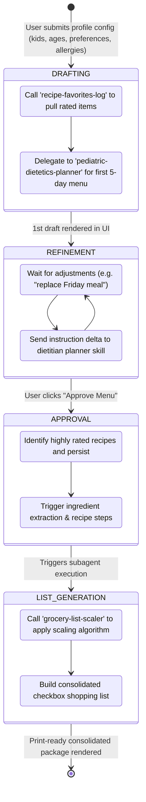

# Lunchbox Genie - Up-to-Date Architecture & Detailed Overview

This document provides a comprehensive technical overview of the **Lunchbox Genie (School Lunch Planner)** system architecture. It outlines the frontend interface, the backend server, the session state machine, the Google Antigravity SDK simulator, and the multi-agent skill architecture.

---

## 1. System Architecture Diagram

The system is built as a lightweight client-server application. It integrates a responsive, print-optimized frontend with a local Python REST backend that drives a multi-agent planning workflow using the **Google Antigravity SDK** and the **Gemini API**.

```mermaid
graph TD
    subgraph Frontend [Frontend: Glassmorphic Bento UI]
        UI["index.html (HTML5, Vanilla CSS, JS)"]
        Print["Print Media Styles (@media print)"]
    end

    subgraph Backend [Backend: http.server / app.py]
        API["REST API Request Router"]
        SessionStore["In-Memory Sessions (sessions dict)"]
    end

    subgraph Database [Persistence Layer]
        FavDB[("favorites_recipes.json")]
        HistoryDB[("~/.gemini/antigravity/conversations/history_*.json")]
    end

    subgraph SDK [Google Antigravity SDK (google/antigravity.py)]
        AGY["Agent & LocalAgentConfig"]
        SkillsLoader["Dynamic Skills Loader"]
    end

    subgraph LLM [Google Gemini API]
        GeminiFlash35["gemini-3.5-flash (Primary)"]
        GeminiFlash25["gemini-2.5-flash (Fallback)"]
    end

    subgraph Skills [Skills System (skills/)]
        Orch["lunchbox_genie_orchestration (State Machine)"]
        Diet["pediatric_dietetics_planner (Nutrition & Allergies)"]
        Groc["grocery_list_scaler (Scaling & Consolidation)"]
        FavLog["recipe_favorites_log (Persistence Interface)"]
    end

    %% Interactions
    UI -->|1. GET /api/favorites| API
    UI -->|2. POST /api/draft| API
    UI -->|3. POST /api/refine| API
    UI -->|4. POST /api/approve| API
    UI -->|5. POST /api/rate| API

    API -->|Read/Write Favorites| FavDB
    API -->|Manage Chat Sessions| SessionStore
    SessionStore -->|Instantiate / Chat| AGY

    AGY -->|Read SKILL.md instructions| SkillsLoader
    SkillsLoader -->|Scans| Skills
    Diet -.->|Allergy Substitutes| AllergyRef["references/allergy_substitutions.json"]

    AGY -->|POST Request / v1beta API| GeminiFlash35
    GeminiFlash35 -->|On Fail Fallback| GeminiFlash25
    AGY -->|Persist History JSON| HistoryDB
```

---

## 2. Dynamic Session State Machine

The orchestration skill (`lunchbox_genie_orchestration`) directs the planning session using a defined state machine, transitioning step-by-step through the following stages:



---

## 3. Component Details & Design Specs

### A. Frontend Web App (`index.html`)
- **UI Styling**: Styled with a **glassmorphic dark-themed design system** using HSL tailormade colors, a bento grid structure, smooth animations, and a blurred backdrop filter (`backdrop-filter: blur(12px)`).
- **Core Panels**:
  - *Sidebar Pane*: Configuration form (Kid count, ages, includes, avoids) + live-loaded Favorites Recipe Log.
  - *Main Board Pane*: Dynamic workspace displaying the Loading overlay, Welcome intro, active Menu Draft (with refinement comment box), or the finalized approved package.
- **Print Optimization**: A custom stylesheet block (`@media print`) strips background colors, converts dark colors to crisp high-contrast black text on white, and hides controls/sidebars to ensure the final grocery checklist and recipes print perfectly.
- **Key Interactivity**:
  - Interactive grocery shopping checkboxes.
  - A custom 3-star rating component for each recipe card that performs real-time database updates.

### B. Python Server Backend (`app.py`)
A single-file server utilizing Python's built-in `http.server` module to avoid third-party dependencies.
- **Session Store**: An in-memory dictionary `sessions` tracks instantiated `Agent` objects keyed by their unique `conversation_id`.
- **API Router**: Handles CORS preflights and maps routes:
  - `GET /` & `/index.html` -> Serves frontend source.
  - `GET /api/favorites` -> Reads from `favorites_recipes.json`.
  - `POST /api/draft` -> Instantiates a new Agent with the dynamic skills directory, starts a chat session, and returns the first menu draft.
  - `POST /api/refine` -> Retrieves/reconnects the active Agent and sends refinement feedback.
  - `POST /api/approve` -> Steps the agent through grocery compilation and recipe step generation.
  - `POST /api/rate` -> Updates `favorites_recipes.json` with user star ratings and notes.

### C. Mock Google Antigravity SDK (`google/antigravity.py`)
Simulates the actual Google Antigravity SDK pipeline:
1. **Dynamic Skills Compilation**: Checks `skills_paths` during agent instantiation, recursively parsing frontmatter and contents of all `SKILL.md` markdown files.
2. **Gemini Live Integration**: Sends HTTP POST requests directly to the Gemini API (`v1beta` models) using standard library utilities `urllib.request` and `ssl`.
3. **Model Fallback Logic**:
   - Attempts to use the high-performance model `gemini-3.5-flash`.
   - If a failure occurs (API key exhaustion, rate limits, server error), it falls back to `gemini-2.5-flash` automatically and flags a UI notification.
4. **Agent State Persistence**: Conversations are saved as local JSON session files under `~/.gemini/antigravity/conversations/history_<conversation_id>.json`.

---

## 4. Agent Skills Specification

| Skill Name & Folder | Purpose | Core Business Logic / Algorithms |
| :--- | :--- | :--- |
| **`lunchbox-genie-orchestration`**<br>[SKILL.md](file:///Users/alisa/Documents/5day%20AI%20intensive%20with%20Google/Capstone%20Project/skills/lunchbox_genie_orchestration/SKILL.md) | Manages state machine flow and user dialogue loops. | Evaluates approval status, manages context passing, and delegates prompts to pediatric and grocery systems. |
| **`pediatric-dietetics-planner`**<br>[SKILL.md](file:///Users/alisa/Documents/5day%20AI%20intensive%20with%20Google/Capstone%20Project/skills/pediatric_dietetics_planner/SKILL.md) | Generates school-safe, nutritionally complete meals. | • Zero-tolerance allergens: Reads [allergy_substitutions.json](file:///Users/alisa/Documents/5day%20AI%20intensive%20with%20Google/Capstone%20Project/skills/pediatric_dietetics_planner/references/allergy_substitutions.json) to substitute peanut/dairy products.<br>• Validates 5 lunchbox pillars: Protein, Vitamin, Veggie, Carb, and Fat.<br>• Groups meals by packing mechanism (Cold Pack vs. Thermos). |
| **`grocery-list-scaler`**<br>[SKILL.md](file:///Users/alisa/Documents/5day%20AI%20intensive%20with%20Google/Capstone%20Project/skills/grocery_list_scaler/SKILL.md) | Compiles and scales quantities for shopping list. | • Formula:<br>  $$\text{Total Qty} = \text{Serving Size Per Kid} \times \text{Kids Count} \times \text{Menu Frequency}$$<br>• Rounds fractional quantities up to standard retail packages.<br>• Organizes shopping list by grocery aisles. |
| **`recipe-favorites-log`**<br>[SKILL.md](file:///Users/alisa/Documents/5day%20AI%20intensive%20with%20Google/Capstone%20Project/skills/recipe_favorites_log/SKILL.md) | Interlines Agent logic with the JSON database. | Performs validation on schema attributes (`id`, `name`, `ingredients`, `rating`, `last_planned_date`) before persisting. |

---

## 5. Database Schema & Data Dumps

### Favorites Recipes Database Schema (`favorites_recipes.json`)
The favorites database is serialized as a flat JSON array of objects:
```json
[
  {
    "id": "3604e5de",
    "name": "Turkey Pinwheels",
    "rating": 3,
    "notes": "Kids loved it"
  }
]
```

### Dynamic Session History Schema
Saved under `~/.gemini/antigravity/conversations/history_<id>.json`:
```json
[
  {
    "role": "user",
    "parts": [
      {
        "text": "Plan a weekly school lunch menu for 2 kids (ages 5, 8). Include: wraps, pasta salad. Avoid/Allergies: peanuts. Output the menu as a clean markdown table."
      }
    ]
  },
  {
    "role": "model",
    "parts": [
      {
        "text": "... [Markdown Table Output] ..."
      }
    ]
  }
]
```
